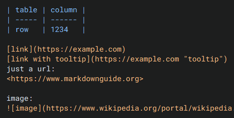

# CTkSyntaxHighlightedTextbox

CTkSyntaxHighlightedTextbox is a customtkinter textbox with built in syntax highlighting.<br>
The syntax highlighting is fully customizable a works using regexes.

i made this because i needed it for another project and i decided to publish it

ps sorry for the long name i couldnt come up with a better one

## CTkSyntaxHighlightedTextbox

### arguments

there currently is only one extra argument: `tags`<br>
tags can either be a `dict` or a `pathlib.Path` pointing to a json file containing said dict<br>
the structure of the dict is the following:<br>

```python
{"tags":[{
    "name":"Example",
    "text_color":"#f00",
    "background":"#000",
    "patterns":["e"]}]
}
```

**"tags"** tags is a list that contains any number of dicts called "tags"<br>
a tag has 4 elements:

- "name" unique identifier of the tag
- "text_color" (optional) the color of the tagged text
- "background" (optional) the color of the background of the tagged text
- "patterns" a list of regex patterns. All text that matches one of these patterns wil be tagged

### methods

#### replace_tags_dict

load a new tags dict<br>
the argument `tags` works the same as the `tags` argument of the main class explained above

#### highlight

runs the HighlightingEngine<br>
automaticaly called on initialisation and the `<<Modified>>` and `<Key>` events

## example

```python
import CTkSyntaxHighighlightedTextbox as CTkSyHiText
import customtkinter as ctk

win = ctk.CTk()

textbox = CTkSyHiText.CTkSyntaxHighlightedTextbox(
    master=win,
    tags={
        "tags": [
            {
                "name": "e",
                "text_color": "#080",
                "background": "#ddd",
                "patterns": ["e"],
            },
            {
                "name": "t",
                "text_color": "#f00",
                "patterns": ["t"],
            },
        ]
    },
)

textbox.pack(fill=ctk.BOTH, expand=True)

textbox.insert("1.0", "the e's & t's in this sentence will be highlighted") # textbox.highlight() runs automaticaly

win.mainloop()
```

the above example doesnt look amazing but thats not the point of the example<br>
here is a image of what it can look like if some proper styling is done:

